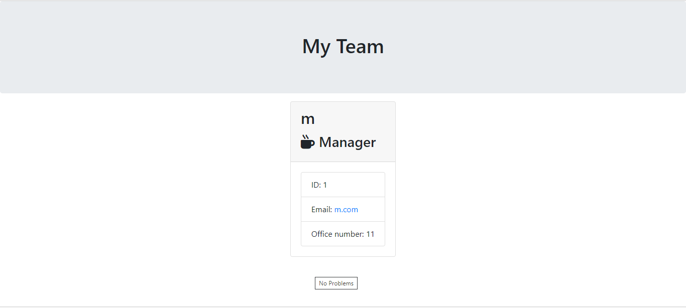

# Employee Summary
## Description
* Takes in user input about details of team members in their engineering project
* Assigns each team member to an instance of a class based on the role they occupy within the project team
* Pushes class instances into an array called employeelist
* Array is parsed into a function which renders html content with the selected details of each employee in card classes
* Content is written into an html named team.html
* Output is a summary of details of each employee team memeber in the team in a visually appealing format
## Image 

## Link
https://github.com/sid-666/Employee-Summary